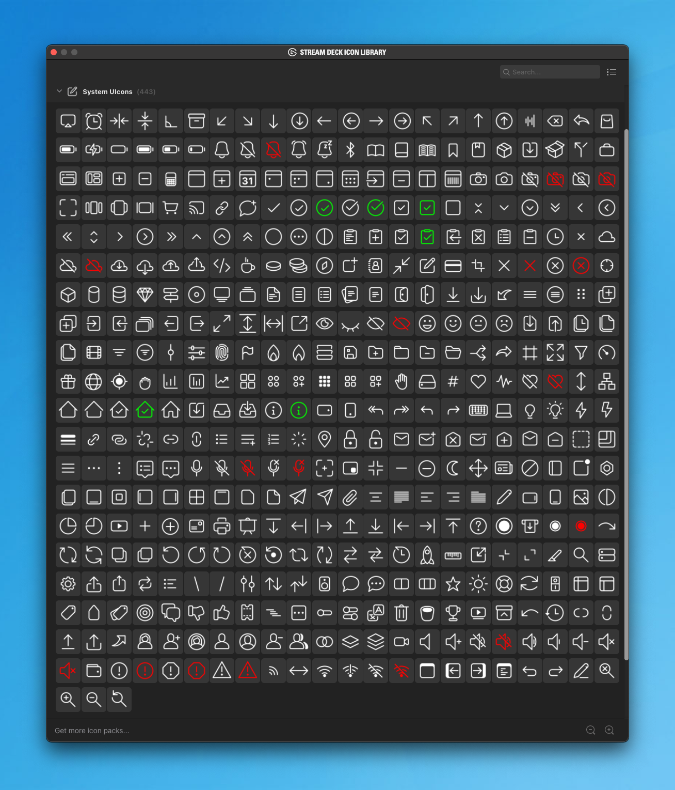

# Stream Deck icon pack: System UIcons

This is a free icon pack for the [Elgato Stream Deck](https://www.elgato.com/en/stream-deck),
based on the clear and concise [System UIcons](https://systemuicons.com/) by
[Corey Ginnivan](https://corey.ginnivan.net/). Thanks, Corey!

The pack consists of 420 monochrome icons (PNG, 144×144px). 23 of them come with
red/green alternatives.

## Screenshot

## How to install

1. Download the `Source code (ZIP)` of the [latest release](releases)
2. Extract the downloaded ZIP file. Find the contained folder named `system-uicons.sdIconPack`
3. Move `system-uicons.sdIconPack` into the `IconPacks/` directory in your local SD data folder✱
4. Quit the Stream Deck software and restart it
5. The icon pack should now be available in your Stream Deck Icon Library

✱) On macOS, that's `$HOME/Library/Application Support/com.elgato.StreamDeck/IconPacks`,
on Windows it's probably `C:\Users\you\AppData\Roaming\Elgato\StreamDeck\IconPacks`.

## Why

I like clean, "readable" icons, preferrably on a black background. I'm over 40,
maybe there's a relation, what do I know. `¯\_(ツ)_/¯`

## Authors & License

This repository and the finished icon packs are [MIT licensed](LICENSE.md) by
Carlo Zottmann ([website](https://czm.io), [Github](https://github.com/carlo)).

The original [System UIcons](https://systemuicons.com/)
([Github](https://github.com/CoreyGinnivan/system-uicons)) by
[Corey Ginnivan](https://corey.ginnivan.net/) are released under
[The Unlicense](https://github.com/CoreyGinnivan/system-uicons/blob/master/LICENSE).
I'd like to thank Corey for his generous work.
